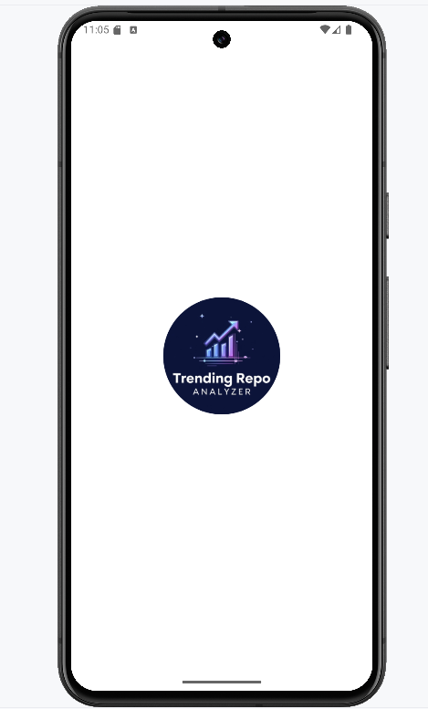
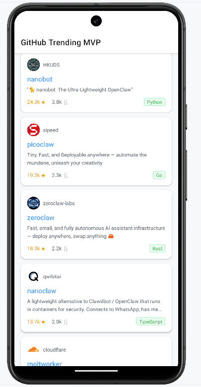
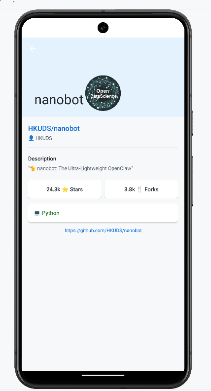

# 🔥 GitHub Trending MVP

Application Android affichant les repositories GitHub les plus populaires des **30 derniers jours**, construite avec l'architecture **MVP (Model-View-Presenter)** en Java.

---

## 📱 Fonctionnalités

- 🔥 Repos trending des 30 derniers jours (date calculée dynamiquement)
- ⭐ Tri par nombre d'étoiles décroissant
- 👤 Avatar + nom du propriétaire
- 📝 Description, langage, stars, forks
- 📜 Pagination au scroll (chargement automatique)
- 🔄 Pull-to-refresh (SwipeRefreshLayout)
- ⚠️ Gestion des erreurs réseau
- 🎨 Thème GitHub blanc

---

## 🏗️ Architecture MVP

```
com.example.githubtrendings/
│
├── model/                       ← MODÈLE (données + accès API)
│   ├── Repo.java                (entité repository avec @SerializedName)
│   ├── RepoResponse.java        (réponse API GitHub Search)
│   ├── GithubApi.java           (interface Retrofit + calcul date 30j)
│   └── RepoRepository.java      (accès aux données via GithubApi)
│
├── view/                        ← VUE (affichage UI uniquement)
│   ├── MainActivity.java        (implémente ReposContract.View)
│   └── ReposAdapter.java        (RecyclerView Adapter)
│
├── presenter/                   ← PRÉSENTEUR (logique métier)
│   ├── ReposContract.java       (interfaces View + Presenter)
│   └── ReposPresenter.java      (logique trending + pagination)
│
├── di/                          ← INJECTION DE DÉPENDANCES
│   ├── AppComponent.java        (composant Dagger 2)
│   ├── NetworkModule.java       (fournit OkHttp, Retrofit, GithubApi)
│   └── RepositoryModule.java    (fournit RepoRepository)
│
└── GithubApp.java               (Application — initialise Dagger 2)
```

---

## 🔄 Flux MVP

```
Utilisateur
    ↓ scroll / pull-to-refresh
VIEW (MainActivity)
    ↓ appelle presenter.loadNextPage() / presenter.refresh()
PRESENTER (ReposPresenter)
    ↓ appelle repository.getTrendingRepos(page, callback)
MODEL (RepoRepository → GithubApi)
    ↓ réponse via Callback Retrofit
PRESENTER
    ↓ traite la réponse, appelle view.showRepos()
VIEW
    ↓ affiche la liste
Écran
```

---

## 🛠️ Stack Technique

| Technologie | Rôle | Pourquoi |
|---|---|---|
| **Java** | Langage principal | Architecture Legacy imposée |
| **Retrofit 2** | Appels API REST | Standard Android pour HTTP |
| **OkHttp** | Client HTTP + logs | Intercepteur pour le debug |
| **Gson** | Désérialisation JSON | Simple et rapide |
| **Dagger 2** | Injection de dépendances | Gestion du cycle de vie des objets |
| **Glide** | Chargement des avatars | Cache + circleCrop automatiques |
| **ViewBinding** | Accès aux vues | Null-safe, remplace findViewById |
| **Callbacks** | Appels asynchrones | Pattern Legacy (pas de Coroutines) |
| **SwipeRefreshLayout** | Pull-to-refresh | UX standard Android |

---

## 🧩 Concepts Clés

### Contract MVP

```java
public interface ReposContract {

    interface View {
        void showLoading();
        void hideLoading();
        void showRepos(List<Repo> repos);
        void showError(String message);
        void showEmptyState();
        void showLoadingMore();
        void hideLoadingMore();
    }

    interface Presenter {
        void loadTrendingRepos();
        void loadNextPage();
        void refresh();
        void onDestroy(); // évite les memory leaks
    }
}
```

### Date dynamique — 30 derniers jours

```java
static String buildQuery() {
    Calendar calendar = Calendar.getInstance();
    calendar.add(Calendar.DAY_OF_YEAR, -30);
    SimpleDateFormat sdf = new SimpleDateFormat("yyyy-MM-dd", Locale.getDefault());
    return "created:>" + sdf.format(calendar.getTime());
}
```

### Éviter les Memory Leaks

```java
@Override
public void onDestroy() {
    view = null; // libère la référence à la View
}
```

---

## 🌐 API utilisée

**GitHub Search API** — [api.github.com](https://api.github.com)

| Endpoint | Description |
|---|---|
| `GET /search/repositories?q=created:>DATE&sort=stars&order=desc` | Repos triés par étoiles |

> ✅ Aucune clé API requise pour les requêtes publiques (60 req/h en anonyme)

---

## 🚀 Installation

1. Clone le projet

```bash
git clone https://github.com/Oumaima-lamdira/GithubTrendingsMVP.git
```

1. Ouvre dans Android Studio

2. **Sync Now** → **Run ▶️**

> Aucune configuration de clé API nécessaire !

---

## 📸 Screenshots

| Icon de l'app |Liste des repos | Détails d'un repo|
|---|---|---|
|  |||

---

## 👩‍💻 Auteur

**Oumaima Lamdira**
Projet réalisé dans le cadre d'un challenge mobile Android.
